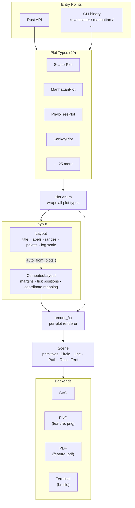

# Architecture

The diagram below shows how a plot moves through the kuva rendering pipeline.
Each plot type implements only its own `render_*()` function — layout, scene
composition, and backend output are shared infrastructure.

