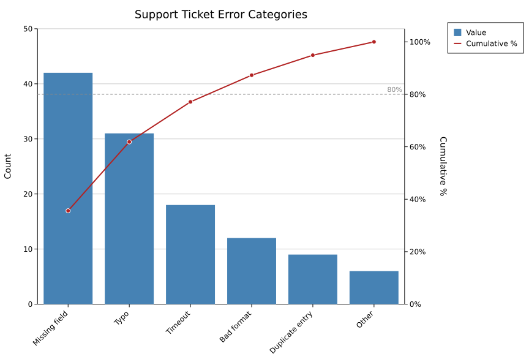
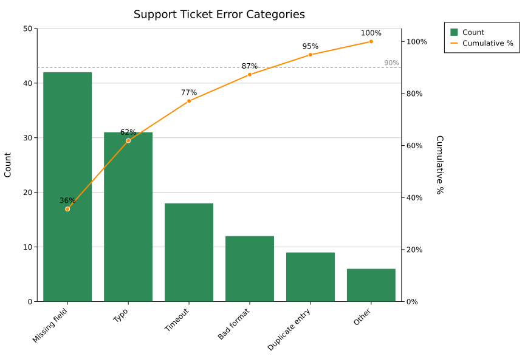
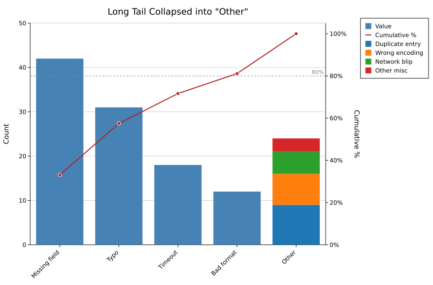
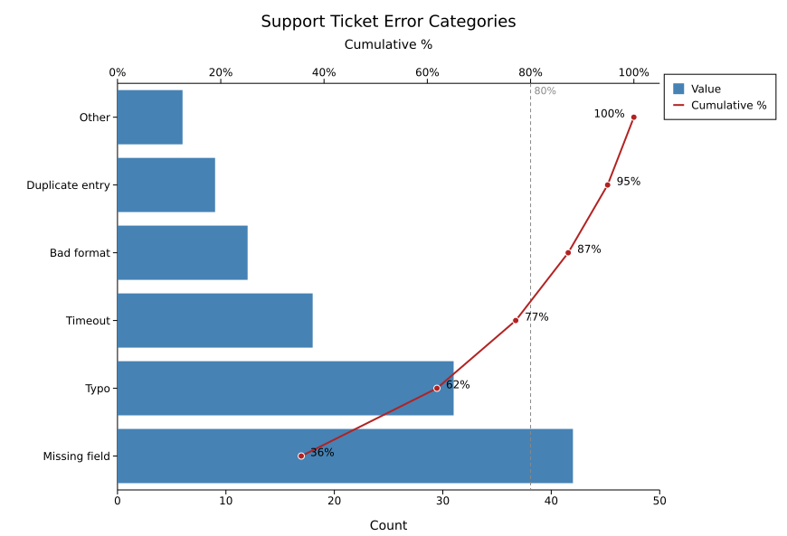

# Pareto Chart

A Pareto chart is a bar chart of category values, sorted descending by default, with a cumulative-percentage line superimposed on a secondary axis (fixed 0-100%). The classic "80/20 rule" chart — a dashed reference line at 80% by default, labeled with its percentage, highlights how many categories account for the bulk of the total. Common in QC, variant analysis, and error-categorisation work.

**Import path:** `kuva::plot::ParetoPlot`

---

## Basic usage

Add categories with `.with_categories()`. Categories are automatically sorted descending by value before rendering (disable with `.with_sorted(false)` to preserve insertion order). A legend showing "Value" / "Cumulative %" appears by default, since the bars and the line are two encodings that always coexist — pass custom labels via `.with_legend()`, or hide it with `.with_show_legend(false)`.

```rust,no_run
use kuva::plot::ParetoPlot;
use kuva::backend::svg::SvgBackend;
use kuva::render::render::render_multiple;
use kuva::render::layout::Layout;
use kuva::render::plots::Plot;

let pareto = ParetoPlot::new().with_categories(vec![
    ("Missing field", 42.0),
    ("Typo", 31.0),
    ("Timeout", 18.0),
    ("Bad format", 12.0),
    ("Duplicate entry", 9.0),
    ("Other", 6.0),
]);

let plots = vec![Plot::Pareto(pareto)];
let layout = Layout::auto_from_plots(&plots)
    .with_title("Support Ticket Error Categories")
    .with_y_label("Count");

let svg = SvgBackend.render_scene(&render_multiple(plots, layout));
std::fs::write("pareto.svg", svg).unwrap();
```



The secondary axis (cumulative %) is always fixed at 0-100% — it's a percentage by construction, not data-driven, so there's nothing to configure — and its ticks are formatted as `0%, 20%, …, 100%` rather than bare numbers. The categorical axis defaults to rotated (-45°), collision-thinned labels, since Pareto data often has more categories than a typical hand-built bar chart.

---

## Styling

```rust,no_run
# use kuva::plot::ParetoPlot;
let pareto = ParetoPlot::new()
    .with_categories(vec![("Missing field", 42.0), ("Typo", 31.0), ("Other", 6.0)])
    .with_color("seagreen")
    .with_line_color("darkorange")
    .with_threshold(90.0)
    .with_cumulative_labels(true)
    .with_legend("Count", "Cumulative %");
```



---

## Collapsing a long tail into "Other"

Real-world Pareto data (defect logs, error taxonomies) often has a long tail of small categories after the top few, cluttering the axis. `.with_max_categories(n)` collapses everything beyond the top `n - 1` into one bar — but instead of silently summing the tail into an opaque total, that bar renders as a **stack** of its constituent categories, each decoded via its own legend entry, so nothing is hidden.

```rust,no_run
# use kuva::plot::ParetoPlot;
let pareto = ParetoPlot::new()
    .with_categories(vec![
        ("Missing field", 42.0), ("Typo", 31.0), ("Timeout", 18.0), ("Bad format", 12.0),
        ("Duplicate entry", 9.0), ("Wrong encoding", 7.0), ("Network blip", 5.0), ("Other misc", 3.0),
    ])
    .with_max_categories(5); // keeps the top 4 + one "Other" bar for the rest
```



The bucket contributes exactly one point to the cumulative line, matching its one slot on the axis. Use `.with_other_label(str)` to rename the bucket (default `"Other"`).

---

## Horizontal mode

`.with_horizontal(true)` puts categories on the Y-axis and values on the X-axis — useful when category names are long. The cumulative-% line moves to a secondary **X**-axis drawn on top of the plot (rather than the secondary Y-axis on the right), since the secondary axis always pairs with whichever axis carries values.

```rust,no_run
# use kuva::plot::ParetoPlot;
let pareto = ParetoPlot::new()
    .with_categories(vec![("Missing field", 42.0), ("Typo", 31.0), ("Other", 6.0)])
    .with_horizontal(true)
    .with_cumulative_labels(true);
```



---

## Builder reference

| Method | Default | Description |
|---|---|---|
| `.with_category(label, value)` | — | Add a single category |
| `.with_categories(iter)` | — | Add multiple `(label, value)` pairs |
| `.with_color(css)` | `"steelblue"` | Bar fill color |
| `.with_line_color(css)` | `"firebrick"` | Cumulative-line color |
| `.with_width(frac)` | `0.8` | Bar width as a fraction of the category slot |
| `.with_sorted(bool)` | `true` | Sort descending by value; `false` preserves insertion order |
| `.with_cumulative_labels(bool)` | `false` | Show a `%` label above (or beside, in horizontal mode) each cumulative-line point |
| `.with_threshold(pct)` | `80.0` | Reference-line value; implies `.with_show_threshold(true)` |
| `.with_show_threshold(bool)` | `true` | Toggle the dashed reference line |
| `.with_legend(bar_label, line_label)` | `"Value"`, `"Cumulative %"` | Legend labels for the bars and the cumulative line |
| `.with_show_legend(bool)` | `true` | Toggle the legend |
| `.with_max_categories(n)` | — (no bucketing) | Collapse categories beyond the top `n - 1` into one stacked "Other" bar |
| `.with_other_label(str)` | `"Other"` | Label for the bucketed bar |
| `.with_horizontal(bool)` | `false` | Categories on Y, values on X; cumulative line on a secondary X-axis |

**See also:** [Bar Chart](./bar.md) for plain (non-cumulative) categorical bars, [Funnel Chart](./funnel.md) for a different stage-drop-off visualization.

---

## CLI

**Input:** one row per category with a label column and a value column.

| Flag | Default | Description |
|---|---|---|
| `--label-col <COL>` | `0` | Category label column |
| `--value-col <COL>` | `1` | Category value column |
| `--color <CSS>` | `steelblue` | Bar fill color |
| `--line-color <CSS>` | `firebrick` | Cumulative-line color |
| `--bar-width <FRAC>` | `0.8` | Bar width as a fraction of the category slot |
| `--no-sort` | off | Preserve input row order instead of sorting descending by value |
| `--threshold <PCT>` | `80.0` | Reference-line value (cumulative %) |
| `--no-threshold` | off | Hide the dashed reference line |
| `--cumulative-labels` | off | Show a `%` label above (or beside, in `--horizontal` mode) each cumulative-line point |
| `--legend <BAR,LINE>` | `Value,Cumulative %` | Legend labels for the bars and the cumulative line, comma-separated |
| `--no-legend` | off | Hide the legend (shown by default) |
| `--max-categories <N>` | — (no bucketing) | Collapse categories beyond the top `N - 1` into one stacked "Other" bar |
| `--other-label <STR>` | `Other` | Label for the bucketed bar; no effect without `--max-categories` |
| `--horizontal` | off | Categories on Y-axis, values on X-axis; cumulative line on a secondary X-axis drawn on top |

```bash
kuva pareto data.tsv --label-col category --value-col count

kuva pareto data.tsv --label-col category --value-col count \
    --color seagreen --line-color darkorange --threshold 90 \
    --cumulative-labels --legend "Count,Cumulative %"

kuva pareto data.tsv --label-col category --value-col count \
    --horizontal --max-categories 5 --other-label "Misc"
```

---

*See also: [Shared flags](../cli/index.md#shared-flags) — output, appearance, axes.*
