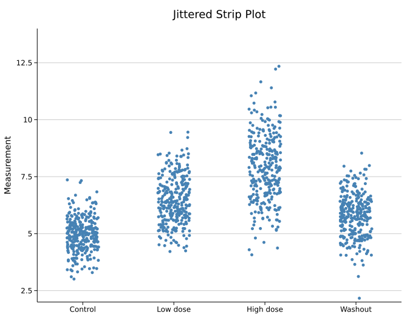
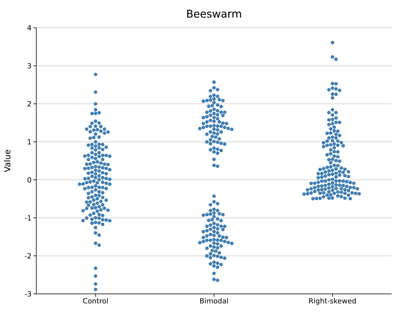
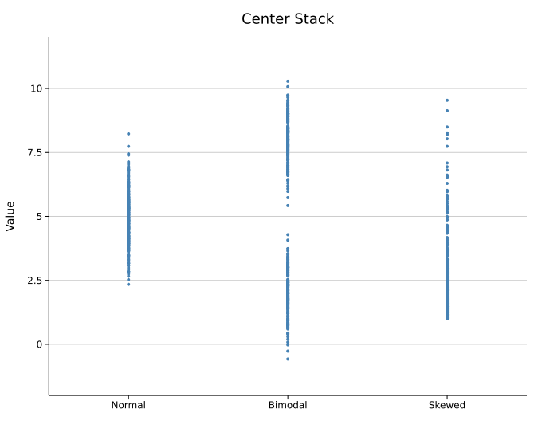
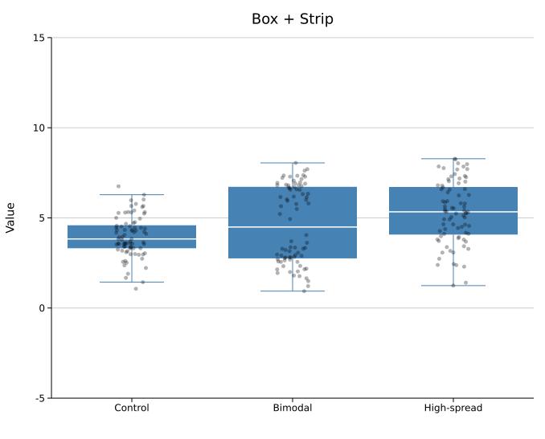
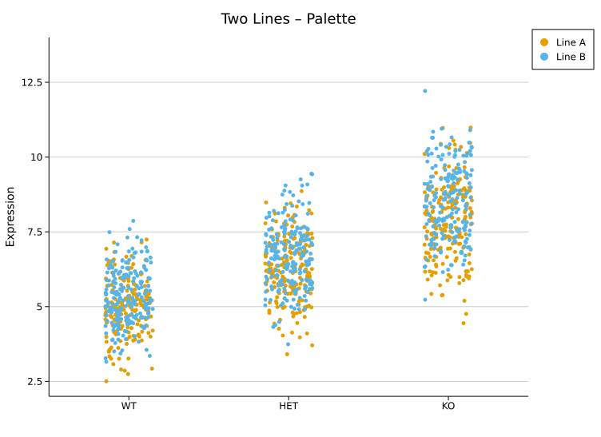
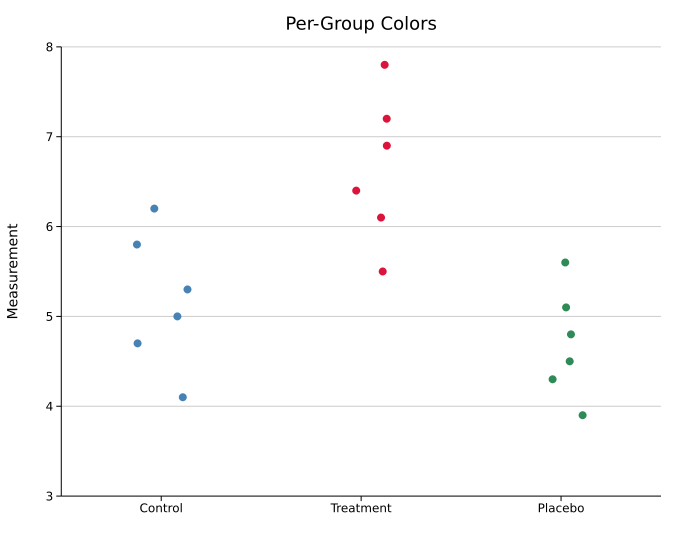
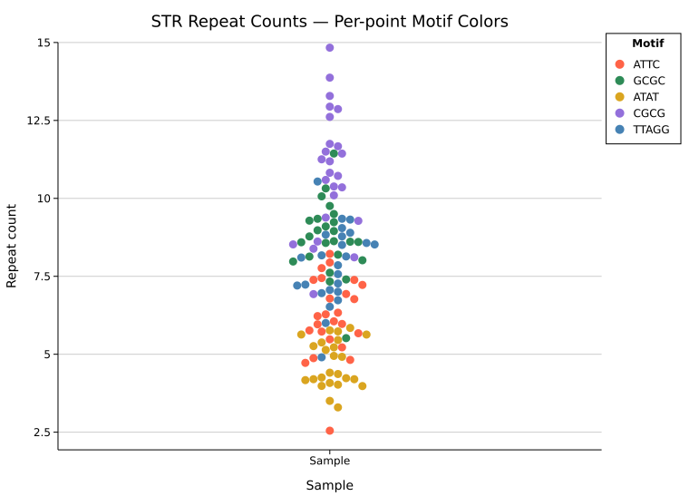
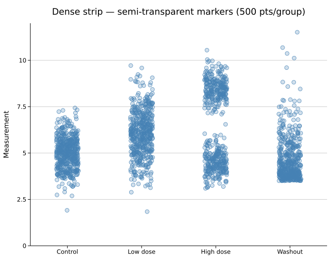

# Strip Plot

A strip plot (dot plot / univariate scatter) shows every individual data point along a categorical axis. Unlike a box or violin, nothing is summarised — the raw values are shown directly, making sample size and exact distribution shape immediately visible.

**Import path:** `kuva::plot::StripPlot`

---

## Basic usage

Add one group per category with `.with_group(label, values)`. Groups are rendered left-to-right in the order they are added.

```rust,no_run
use kuva::plot::StripPlot;
use kuva::backend::svg::SvgBackend;
use kuva::render::render::render_multiple;
use kuva::render::layout::Layout;
use kuva::render::plots::Plot;

let strip = StripPlot::new()
    .with_group("Control",   control_data)
    .with_group("Low dose",  low_data)
    .with_group("High dose", high_data)
    .with_group("Washout",   washout_data)
    .with_color("steelblue")
    .with_point_size(2.5)
    .with_jitter(0.35);

let plots = vec![Plot::Strip(strip)];
let layout = Layout::auto_from_plots(&plots)
    .with_title("Jittered Strip Plot")
    .with_y_label("Measurement");

let scene = render_multiple(plots, layout);
let svg = SvgBackend.render_scene(&scene);
std::fs::write("strip.svg", svg).unwrap();
```



300 points per group. The jitter cloud fills out the slot width, making the spread and central tendency of each distribution easy to compare.

---

## Layout modes

Three modes control how points are spread horizontally within each group slot.

### Jittered strip

`.with_jitter(j)` assigns each point a random horizontal offset. `j` is the half-width as a fraction of the slot — `0.3` spreads points ±30 % of the slot width. This is the default (`j = 0.3`).

Use a smaller `j` to tighten the column or a larger `j` to spread it out. The jitter positions are randomised with a fixed seed (changeable via `.with_seed()`), so output is reproducible.

```rust,no_run
# use kuva::plot::StripPlot;
let strip = StripPlot::new()
    .with_group("A", data)
    .with_jitter(0.35)      // ±35 % of slot width
    .with_point_size(2.5);
```

### Beeswarm

`.with_swarm()` uses a deterministic algorithm to place each point as close to the group center as possible without overlapping any already-placed point. The outline of the resulting shape traces the density of the distribution.

Swarm works best for **N < ~200 per group**. With very large N, points are pushed far from center and the spread becomes impractical.

```rust,no_run
use kuva::plot::StripPlot;
use kuva::backend::svg::SvgBackend;
use kuva::render::render::render_multiple;
use kuva::render::layout::Layout;
use kuva::render::plots::Plot;

let strip = StripPlot::new()
    .with_group("Control",      normal_data)
    .with_group("Bimodal",      bimodal_data)
    .with_group("Right-skewed", skewed_data)
    .with_color("steelblue")
    .with_point_size(3.0)
    .with_swarm();

let plots = vec![Plot::Strip(strip)];
let layout = Layout::auto_from_plots(&plots)
    .with_title("Beeswarm")
    .with_y_label("Value");

let svg = SvgBackend.render_scene(&render_multiple(plots, layout));
```



150 points per group. The bimodal group shows two distinct lobes; the right-skewed group shows the long tail — structure that jitter reveals less cleanly at this sample size.

### Center stack

`.with_center()` places all points at x = group center with no horizontal spread, creating a vertical column. The density of the distribution is readable directly from where points are most tightly packed.

```rust,no_run
# use kuva::plot::StripPlot;
let strip = StripPlot::new()
    .with_group("Normal",  normal_data)
    .with_group("Bimodal", bimodal_data)
    .with_group("Skewed",  skewed_data)
    .with_color("steelblue")
    .with_point_size(2.0)
    .with_center();
```



400 points per group. The bimodal group shows a clear gap in the column; the skewed group has a dense cluster at the low end thinning toward the tail.

---

## Composing with a box plot

A `StripPlot` can be layered on top of a `BoxPlot` by passing both to `render_multiple`. Use a semi-transparent `rgba` color for the strip so the box summary remains legible underneath.

```rust,no_run
use kuva::plot::{StripPlot, BoxPlot};
use kuva::backend::svg::SvgBackend;
use kuva::render::render::render_multiple;
use kuva::render::layout::Layout;
use kuva::render::plots::Plot;

let boxplot = BoxPlot::new()
    .with_group("Control",     control_data.clone())
    .with_group("Bimodal",     bimodal_data.clone())
    .with_group("High-spread", spread_data.clone())
    .with_color("steelblue");

let strip = StripPlot::new()
    .with_group("Control",     control_data)
    .with_group("Bimodal",     bimodal_data)
    .with_group("High-spread", spread_data)
    .with_color("rgba(0,0,0,0.3)")   // semi-transparent so box shows through
    .with_point_size(2.5)
    .with_jitter(0.2);

let plots = vec![Plot::Box(boxplot), Plot::Strip(strip)];
let layout = Layout::auto_from_plots(&plots)
    .with_title("Box + Strip")
    .with_y_label("Value");

let svg = SvgBackend.render_scene(&render_multiple(plots, layout));
```



The box summarises Q1/median/Q3; the individual points reveal that the bimodal group has two sub-populations the box conceals entirely.

---

## Multiple strip plots with a palette

Passing multiple `StripPlot`s to `render_multiple` with a `Layout::with_palette()` auto-assigns distinct colors. Attach `.with_legend()` to each plot to identify them.

```rust,no_run
use kuva::plot::StripPlot;
use kuva::backend::svg::SvgBackend;
use kuva::render::render::render_multiple;
use kuva::render::layout::Layout;
use kuva::render::plots::Plot;
use kuva::Palette;

let line_a = StripPlot::new()
    .with_group("WT",  wt_a).with_group("HET", het_a).with_group("KO", ko_a)
    .with_jitter(0.3).with_point_size(2.5)
    .with_legend("Line A");

let line_b = StripPlot::new()
    .with_group("WT",  wt_b).with_group("HET", het_b).with_group("KO", ko_b)
    .with_jitter(0.3).with_point_size(2.5)
    .with_legend("Line B");

let plots = vec![Plot::Strip(line_a), Plot::Strip(line_b)];
let layout = Layout::auto_from_plots(&plots)
    .with_title("Two Lines – Palette")
    .with_y_label("Expression")
    .with_palette(Palette::wong());

let svg = SvgBackend.render_scene(&render_multiple(plots, layout));
```



---

## Per-group colors

Color each group independently within a single `StripPlot` using `.with_group_colors()`. Colors are matched to groups by position — the first color applies to the first group added, and so on. The uniform `.with_color()` value is used as a fallback for any group without an entry.

This is an alternative to creating one `StripPlot` per group when the data is already grouped. The legend is **not** updated automatically; use separate `StripPlot` instances with `.with_legend()` when you need labeled legend entries.

```rust,no_run
use kuva::plot::StripPlot;
use kuva::backend::svg::SvgBackend;
use kuva::render::render::render_multiple;
use kuva::render::layout::Layout;
use kuva::render::plots::Plot;

let strip = StripPlot::new()
    .with_group("Control",   vec![4.1, 5.0, 5.3, 5.8, 6.2, 4.7])
    .with_group("Treatment", vec![5.5, 6.1, 6.4, 7.2, 7.8, 6.9])
    .with_group("Placebo",   vec![3.9, 4.5, 4.8, 5.1, 5.6, 4.3])
    .with_group_colors(vec!["steelblue", "crimson", "seagreen"])
    .with_point_size(4.0)
    .with_jitter(0.3);

let plots = vec![Plot::Strip(strip)];
let layout = Layout::auto_from_plots(&plots)
    .with_title("Per-Group Colors")
    .with_y_label("Measurement");

let svg = SvgBackend.render_scene(&render_multiple(plots, layout));
```



---

## Per-point colors

`.with_colored_group(label, points)` adds a group where each point carries its own color. `points` is any iterator of `(value, color)` pairs — the value and color travel together. Points beyond the end of the color list fall back to the group/uniform color.

This is useful when each observation belongs to a distinct category within a single sample column — for example, coloring reads by their primary repeat motif in a STR genotyping view.

```rust,no_run
use kuva::plot::{StripPlot, LegendEntry, LegendShape, LegendPosition};
use kuva::backend::svg::SvgBackend;
use kuva::render::render::render_multiple;
use kuva::render::layout::Layout;
use kuva::render::plots::Plot;

let strip = StripPlot::new()
    .with_colored_group("Sample", vec![
        (6.1, "tomato"),       // ATTC repeat
        (9.3, "seagreen"),     // GCGC repeat
        (4.8, "goldenrod"),    // ATAT repeat
        (11.2, "mediumpurple"), // CGCG repeat
        (7.0, "steelblue"),   // TTAGG repeat
        // … more reads
    ])
    .with_swarm()
    .with_point_size(4.5);

// Per-point colors are not reflected in the auto-legend — supply entries manually.
let legend_entries = vec![
    LegendEntry { label: "ATTC".into(),  color: "tomato".into(),       shape: LegendShape::Circle, dasharray: None },
    LegendEntry { label: "GCGC".into(),  color: "seagreen".into(),     shape: LegendShape::Circle, dasharray: None },
    LegendEntry { label: "ATAT".into(),  color: "goldenrod".into(),    shape: LegendShape::Circle, dasharray: None },
    LegendEntry { label: "CGCG".into(),  color: "mediumpurple".into(), shape: LegendShape::Circle, dasharray: None },
    LegendEntry { label: "TTAGG".into(), color: "steelblue".into(),    shape: LegendShape::Circle, dasharray: None },
];

let plots = vec![Plot::Strip(strip)];
let layout = Layout::auto_from_plots(&plots)
    .with_title("STR Repeat Counts — Per-point Motif Colors")
    .with_x_label("Sample")
    .with_y_label("Repeat count")
    .with_legend_title("Motif")
    .with_legend_entries(legend_entries)
    .with_legend_position(LegendPosition::OutsideRightTop);

let svg = SvgBackend.render_scene(&render_multiple(plots, layout));
std::fs::write("point_colors.svg", svg).unwrap();
```



> **Legend note:** `.with_colored_group` does not auto-populate the legend. Supply entries manually via `Layout::with_legend_entries` (with `LegendShape::Circle`) as shown above. For per-*group* coloring (one color per column, not per point) see [Per-group colors](#per-group-colors) above.

---

## Marker opacity and stroke

For dense datasets, the default solid fill causes points to merge into an opaque block. Two builders control fill transparency and an optional outline stroke to keep individual points distinguishable.

### Dense strip — 500 points per group

With 500 points per group, solid markers pile into uniform bars and the shape of each distribution is hidden. Setting `opacity = 0.25` makes denser bands visibly darker — here the bimodal "High dose" group clearly shows two sub-populations, and the skewed "Washout" distribution tapers naturally toward its tail. The thin `0.7 px` stroke keeps points individually readable even where they overlap most.

```rust,no_run
use kuva::plot::StripPlot;
use kuva::backend::svg::SvgBackend;
use kuva::render::render::render_multiple;
use kuva::render::layout::Layout;
use kuva::render::plots::Plot;

// (populate each group with 500 values from your data source)
# let (control, low, high, washout) = (vec![0f64], vec![0f64], vec![0f64], vec![0f64]);
let strip = StripPlot::new()
    .with_group("Control",   control)
    .with_group("Low dose",  low)
    .with_group("High dose", high)   // bimodal — two sub-populations
    .with_group("Washout",   washout) // right-skewed
    .with_color("steelblue")
    .with_point_size(4.0)
    .with_jitter(0.3)
    .with_marker_opacity(0.25)
    .with_marker_stroke_width(0.7);

let plots = vec![Plot::Strip(strip)];
let layout = Layout::auto_from_plots(&plots)
    .with_title("Dense strip — semi-transparent markers (500 pts/group)")
    .with_y_label("Measurement");

let svg = SvgBackend.render_scene(&render_multiple(plots, layout));
```



The stroke color always matches the fill color set by `.with_color()` or `.with_group_colors()`.

---

## API reference

| Method | Description |
|--------|-------------|
| `StripPlot::new()` | Create a strip plot with defaults |
| `.with_group(label, values)` | Add a group; accepts any `Into<f64>` iterable |
| `.with_colored_group(label, points)` | Add a group from `(value, color)` pairs — each point carries its own color |
| `.with_color(s)` | Uniform point fill color (CSS color string, default `"steelblue"`) |
| `.with_group_colors(iter)` | Per-group colors; falls back to `.with_color` for out-of-range indices |
| `.with_point_size(r)` | Point radius in pixels (default `4.0`) |
| `.with_jitter(j)` | Jittered strip layout; `j` is half-width as fraction of slot (default `0.3`) |
| `.with_swarm()` | Beeswarm layout — non-overlapping, best for N < 200 |
| `.with_center()` | All points at group center — vertical density column |
| `.with_seed(n)` | RNG seed for jitter positions (default `42`) |
| `.with_legend(s)` | Attach a legend label |
| `.with_marker_opacity(f)` | Fill alpha: `0.0` = hollow, `1.0` = solid (default: solid) |
| `.with_marker_stroke_width(w)` | Outline stroke at the fill color; `None` = no stroke (default) |

**See also:** [Box Plot](./boxplot.md) for a summary overlay, [Violin Plot](./violin.md) for the full density shape, [Raincloud Plot](./raincloud.md) for all three combined.
