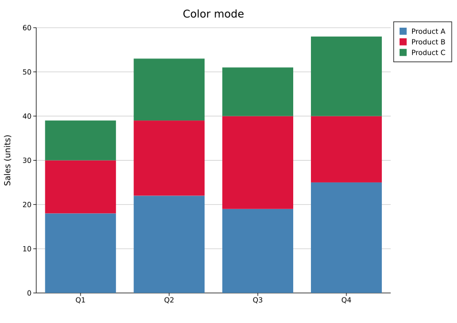
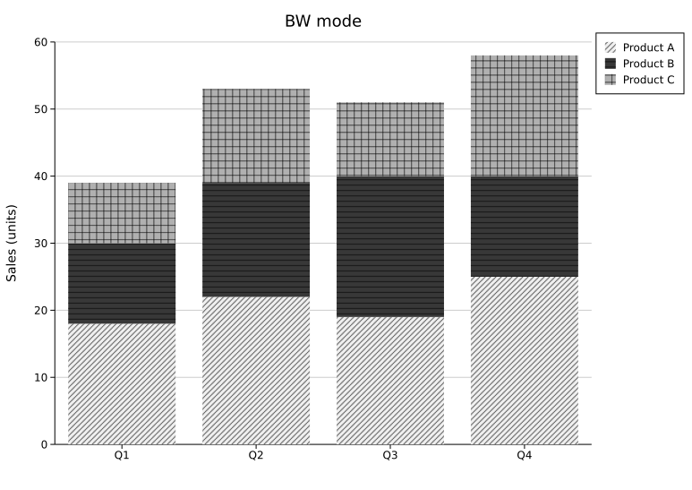
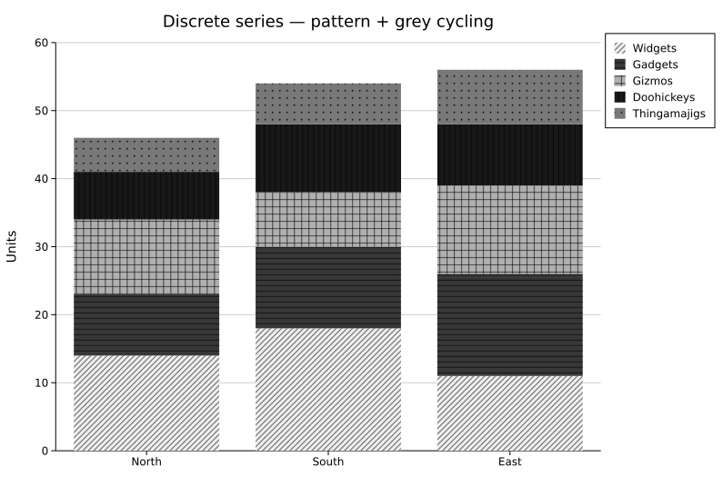
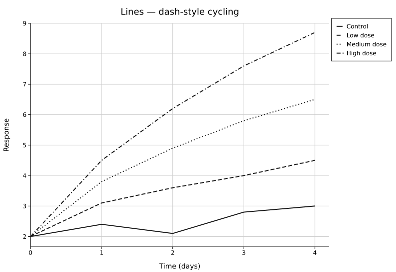
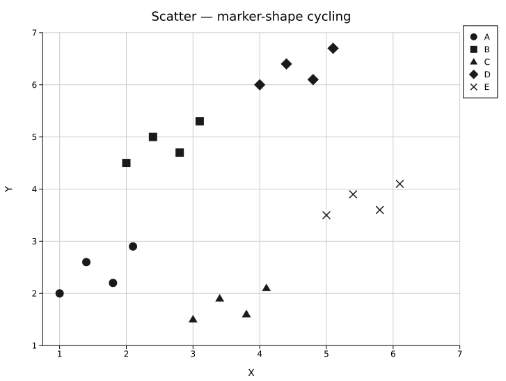
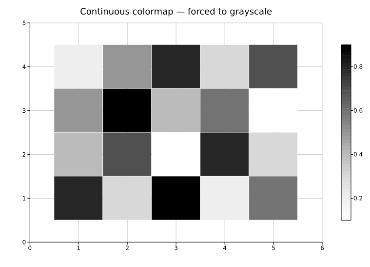

# Black & White / Accessibility Mode

BW mode redraws every plot so it stays legible without relying on color: discrete series are told apart by hatch pattern and grey shade instead of hue, lines cycle through dash styles, scatter markers cycle through shapes, and continuous colormaps are forced to a grayscale ramp. It exists for two overlapping needs — figures that will be printed or photocopied in greyscale, and readers with color-vision deficiencies who can't rely on hue-only encoding.

For a colored (not greyscale) approach to color-vision deficiency, see `--cvd-palette` in [Shared flags](../cli/index.md#shared-flags) instead — it remaps hues so a deuteranope/protanope/tritanope reader can still distinguish series by color. BW mode is the stronger guarantee: it works even when color reproduction fails entirely.

---

## Enabling it

### Rust API

`.with_bw_mode()` is the only change needed — everything else about the plot stays the same:

```rust,no_run
use kuva::backend::svg::SvgBackend;
use kuva::plot::BarPlot;
use kuva::render::layout::Layout;
use kuva::render::plots::Plot;
use kuva::render::render::render_multiple;

let plot = BarPlot::new()
    .with_group("Q1", vec![(18.0, "steelblue"), (12.0, "crimson"), (9.0, "seagreen")])
    .with_group("Q2", vec![(22.0, "steelblue"), (17.0, "crimson"), (14.0, "seagreen")])
    .with_legend(vec!["Product A", "Product B", "Product C"])
    .with_stacked();

let plots = vec![Plot::Bar(plot)];
let layout = Layout::auto_from_plots(&plots)
    .with_bw_mode()
    .with_title("BW mode");

let scene = render_multiple(plots, layout);
let svg = SvgBackend.render_scene(&scene);
std::fs::write("bw_mode.svg", svg).unwrap();
```

<table><tr>
<td></td>
<td></td>
</tr></table>

### CLI

```bash
kuva scatter data.tsv --x x --y y --color-by group --legend --bw
kuva bar data.tsv --label-col category --value-col count --bw
```

`--bw` works on every subcommand and composes with `--theme`/`--background` — BW mode changes data encoding (series differentiation, colormaps), not chrome colors.

---

## What changes

### Discrete series (bar, box, violin, pie, area, and similar fills)

Each series/group gets one of 5 grey shades combined with one of 7 hatch patterns — 35 unique combinations before any repeat, so even plots with many groups stay distinguishable:

| Pattern | Description |
|---|---|
| `DiagonalForward` | Forward-diagonal lines (`///`) |
| `Horizontal` | Horizontal parallel lines |
| `Crosshatch` | Horizontal + vertical grid |
| `Vertical` | Vertical parallel lines |
| `Dots` | Evenly spaced dots |
| `DiagonalBack` | Back-diagonal lines (`\\\`) |
| `DiagonalCrosshatch` | Forward + back diagonal grid (`×××`) |

Hatch line weight is a light `0.6px` stroke (tuned so patterns read as texture, not bold stripes — see the CHANGELOG for the full comparison).



### Lines

Each line series cycles through 4 dash styles: `Solid`, `Dashed`, `Dotted`, `DashDot`.

```rust,no_run
use kuva::backend::svg::SvgBackend;
use kuva::plot::LinePlot;
use kuva::render::layout::Layout;
use kuva::render::plots::Plot;
use kuva::render::render::render_multiple;

let series: Vec<Plot> = vec![
    ("Control", vec![(0.0, 2.0), (1.0, 2.4), (2.0, 2.1), (3.0, 2.8), (4.0, 3.0)]),
    ("Low dose", vec![(0.0, 2.0), (1.0, 3.1), (2.0, 3.6), (3.0, 4.0), (4.0, 4.5)]),
    ("High dose", vec![(0.0, 2.0), (1.0, 4.5), (2.0, 6.2), (3.0, 7.6), (4.0, 8.7)]),
]
.into_iter()
.map(|(name, data)| Plot::Line(LinePlot::new().with_data(data).with_legend(name)))
.collect();

let layout = Layout::auto_from_plots(&series).with_bw_mode();
let svg = SvgBackend.render_scene(&render_multiple(series, layout));
std::fs::write("bw_lines.svg", svg).unwrap();
```



### Scatter / point markers

Each series cycles through 6 marker shapes: `Circle`, `Square`, `Triangle`, `Diamond`, `Cross`, `Plus`.



### Continuous colormaps (heatmap, hexbin, contour, calendar, and similar)

Plots that encode a continuous numeric value via a colormap (rather than discrete series) swap their configured `ColorMap` for `ColorMap::Grayscale` — a white-to-black ramp — at render time. This is unconditional and doesn't require picking a colormap yourself; the swap happens automatically whenever `bw_mode` is on.

`Scatter3D`'s colorbar is suppressed entirely in BW mode rather than grayscaled, since its point fills already ignore `z_colormap` in favor of a flat marker color.



---

## Coverage

All plot types in kuva support BW mode — pixel-space/composite plots (Chord, Sankey, PhyloTree, Synteny, Network, Treemap, Sunburst, Clustermap) included, each with its own bespoke fill/stroke treatment since they don't share a common bar/line/marker helper.

---

## Known limitations

A few characteristics are accepted trade-offs rather than bugs, tracked for a future pass:

- **Sankey / Synteny node borders.** Ribbons intentionally share their source node's/sequence's pattern, so a node's rectangle boundary can be hard to see where a ribbon touches it with an identical pattern. Both get a thin outline in BW mode to mitigate this, but it isn't a complete fix — only about half the nominal stroke width survives, since the pattern-overlay rect drawn on top eclipses the inner half of the stroke.
- **Hexbin / DotPlot / Quiver at the low end of the grayscale range.** `ColorMap::Grayscale` runs white-to-black, so a data point near the low end renders very close to white — genuinely hard to see against a white page for plots whose fill primitive has no default outline (unlike Heatmap/Clustermap/Contour, where adjacent cells already have a border).
- **`Horizontal` pattern at small cell sizes** (e.g. Waffle's default cell size) can look nearly solid rather than textured — the tile period (6-8px) is comparable to the cell size itself, so thinning the stroke further doesn't help.

---

## Custom pattern control

There is currently no user-facing way to choose which patterns/dashes/shapes are used or in what order, or to define custom patterns — BW mode always cycles through the fixed sequences above. A more flexible styling system (custom pattern palettes, additional built-in palette presets) is a candidate for a future release.
