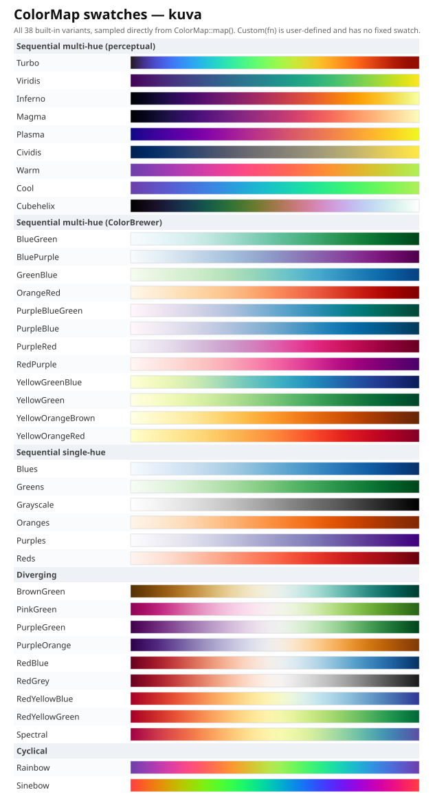

# Colormaps

A `ColorMap` maps a normalized value in `[0.0, 1.0]` to a CSS color string. Use it wherever a plot encodes a continuous quantity as color: heatmap cell values, hexbin/2D-histogram density, treemap/sunburst second-dimension coloring, 3D surface height, and more. This is a different tool from a [`Palette`](./palettes.md): a palette assigns distinct colors to separate categorical series, while a colormap encodes one continuous variable along a gradient.

---

## All 38 built-in variants

Every gradient below is rendered directly from the real `ColorMap::map()` function, not a hand-approximated copy.



---

## Using a colormap

### On a plot

Most plot types that encode continuous values take a colormap via `.with_color_map()` (or a type-specific equivalent):

```rust,no_run
use kuva::plot::{ColorMap, Heatmap};

let heatmap = Heatmap::new()
    .with_data(vec![vec![1.0, 2.0], vec![3.0, 4.0]])
    .with_color_map(ColorMap::Viridis);
```

### Sampling directly

`ColorMap::map(value)` returns the CSS color at that point on the gradient, useful for building custom legends, annotations, or your own derived visuals:

```rust,no_run
use kuva::plot::ColorMap;

let cmap = ColorMap::Turbo;
let low = cmap.map(0.0);   // color at the start of the gradient
let mid = cmap.map(0.5);   // color at the midpoint
let high = cmap.map(1.0);  // color at the end
```

### CLI

Most subcommands that support a colormap accept `--colormap <name>`:

```bash
kuva heatmap data.tsv --colormap viridis
kuva hexbin data.tsv --x x --y y --colormap turbo
kuva treemap data.tsv --color-by value --colormap plasma
```

Accepted names are case-insensitive and accept either a bare word or a hyphenated ColorBrewer-style alias (e.g. `yellow-green-blue`, `yellowgreenblue`, and `ylgnbu` all resolve to the same colormap). An unrecognized name falls back to `viridis` with a warning rather than failing.

---

## Custom colormaps

Wrap any `f64 -> String` mapping in `ColorMap::Custom` for a colormap kuva doesn't ship:

```rust,no_run
use std::sync::Arc;
use kuva::plot::ColorMap;

// Blue-to-red diverging scale
let cmap = ColorMap::Custom(Arc::new(|t: f64| {
    let r = (t * 255.0) as u8;
    let b = ((1.0 - t) * 255.0) as u8;
    format!("rgb({r},0,{b})")
}));
```

`Custom` has no fixed swatch since its output depends entirely on the closure you provide.

---

## API reference

| Variant category | Variants |
|-------------------|----------|
| Sequential multi-hue (perceptual) | `Turbo`, `Viridis`, `Inferno`, `Magma`, `Plasma`, `Cividis`, `Warm`, `Cool`, `Cubehelix` |
| Sequential multi-hue (ColorBrewer) | `BlueGreen`, `BluePurple`, `GreenBlue`, `OrangeRed`, `PurpleBlueGreen`, `PurpleBlue`, `PurpleRed`, `RedPurple`, `YellowGreenBlue`, `YellowGreen`, `YellowOrangeBrown`, `YellowOrangeRed` |
| Sequential single-hue | `Blues`, `Greens`, `Grayscale`, `Oranges`, `Purples`, `Reds` |
| Diverging | `BrownGreen`, `PinkGreen`, `PurpleGreen`, `PurpleOrange`, `RedBlue`, `RedGrey`, `RedYellowBlue`, `RedYellowGreen`, `Spectral` |
| Cyclical | `Rainbow`, `Sinebow` |
| Custom | `Custom(Arc<dyn Fn(f64) -> String + Send + Sync>)` (user-defined) |

| Method | Description |
|--------|-------------|
| `cmap.map(value)` | CSS color string at `value` (clamped to `[0.0, 1.0]`) |

**Picking a colormap:**
- `Viridis` is the default for most plots; perceptually uniform and colorblind-safe, a safe general choice.
- Reach for `Grayscale` when a plot needs to survive black & white printing (see [Black & White / Accessibility Mode](./bw_mode.md)).
- Use a **diverging** colormap (`RedBlue`, `PurpleGreen`, `Spectral`, ...) when the data has a meaningful zero or midpoint, e.g. log-fold-change or a correlation coefficient, so the two directions read as visually distinct.
- Use `Rainbow` or `Sinebow` only for genuinely cyclical data (e.g. angle, day-of-year, phase), never for a plain sequential quantity: cyclical colormaps wrap back to their starting hue, which reads as a false discontinuity on any variable that doesn't actually wrap.
