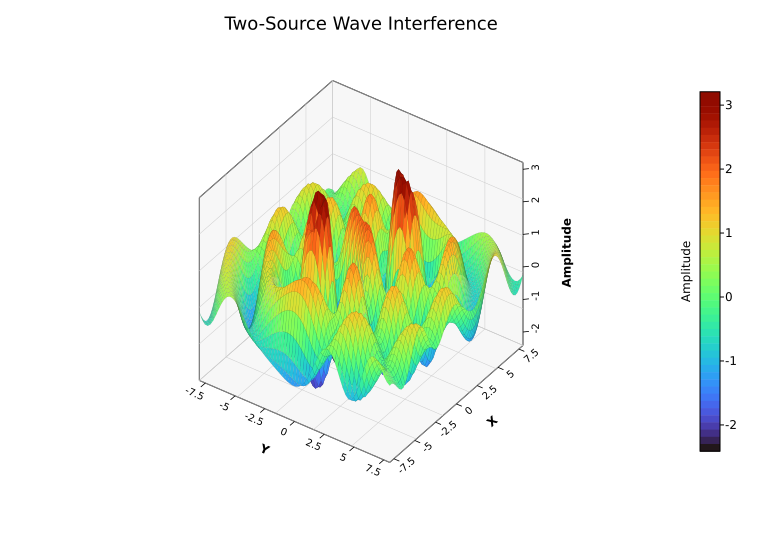
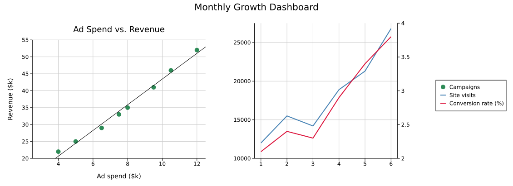
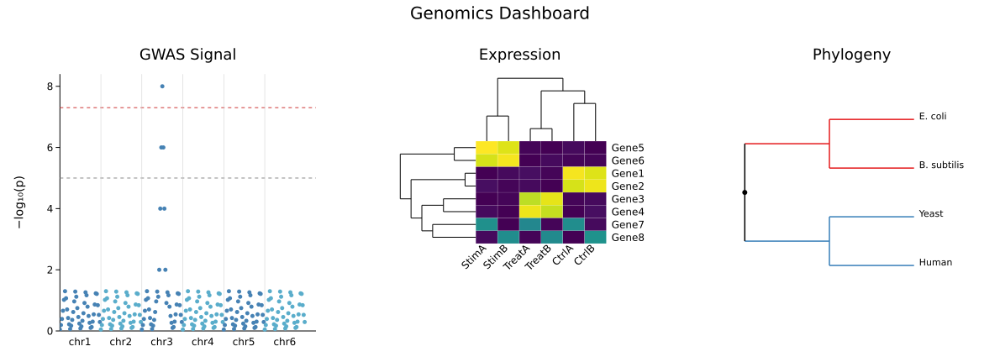
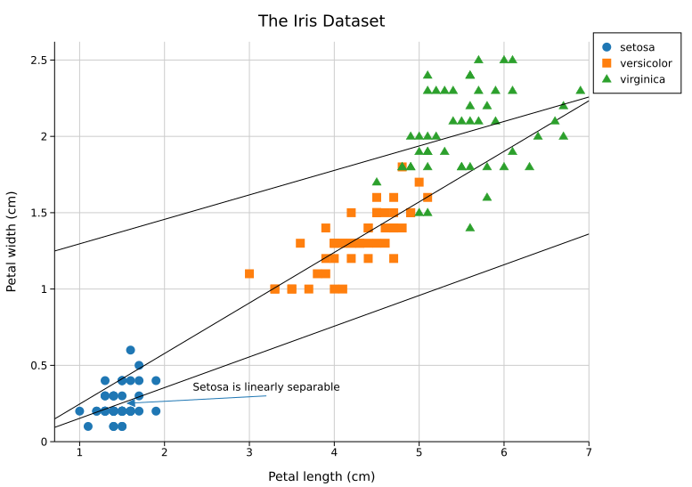
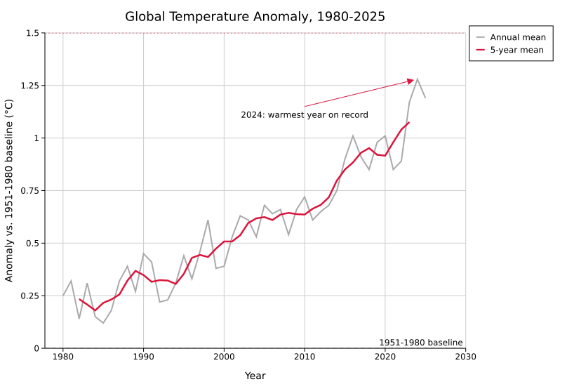
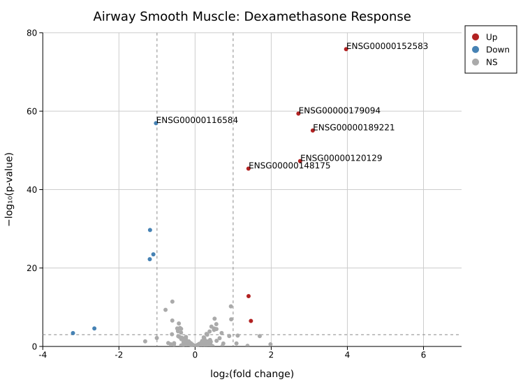
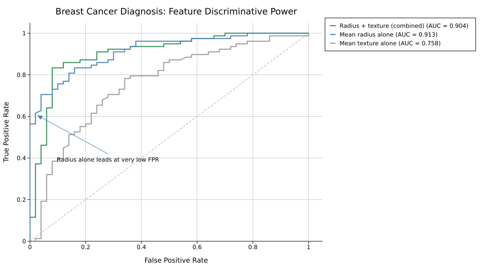
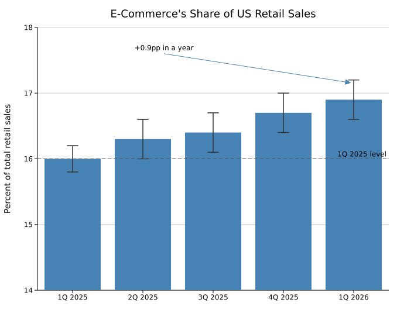

# Showcase

The [Gallery](./gallery.md) is one card per plot type. This page is the opposite: a few elaborate compositions that show what kuva looks like pushed further, not a catalog. Full source for everything below lives in `examples/showcase.rs` (SVGs) and `docs/tapes/` (terminal recordings).

---

## Two-source wave interference

One plot, pushed hard: no multi-panel layout, no dashboard framing, just a single [3D Surface Plot](./plots/surface3d.md) evaluated over a 70x70 grid from two interfering ripple sources, like two stones dropped in a pond. `Surface3DPlot::with_data_fn` builds the grid directly from a closure, so the whole shape is one function.



```rust,no_run
use kuva::backend::svg::SvgBackend;
use kuva::plot::surface3d::Surface3DPlot;
use kuva::plot::ColorMap;
use kuva::render::layout::Layout;
use kuva::render::plots::Plot;
use kuva::render::render::render_multiple;

let source_a = (-3.2, -1.5);
let source_b = (2.6, 2.0);

let z_fn = |x: f64, y: f64| {
    let r_a = ((x - source_a.0).powi(2) + (y - source_a.1).powi(2)).sqrt();
    let r_b = ((x - source_b.0).powi(2) + (y - source_b.1).powi(2)).sqrt();
    let ripple_a = (r_a * 2.2).sin() / (r_a * 0.6 + 1.0);
    let ripple_b = (r_b * 2.2).sin() / (r_b * 0.6 + 1.0);
    3.5 * (ripple_a + ripple_b)
};

let surface = Surface3DPlot::new(vec![])
    .with_data_fn(z_fn, -8.0..=8.0, -8.0..=8.0, 70, 70)
    .with_z_colormap(ColorMap::Turbo)
    .with_wireframe_color("#00000030")
    .with_wireframe_width(0.3)
    .with_azimuth(-55.0)
    .with_elevation(38.0)
    .with_x_label("X")
    .with_y_label("Y")
    .with_z_label("Amplitude");

let plots = vec![Plot::Surface3D(surface)];
let layout = Layout::auto_from_plots(&plots).with_title("Two-Source Wave Interference");
let svg = SvgBackend.render_scene(&render_multiple(plots, layout));
std::fs::write("interference.svg", svg).unwrap();
```

---

## Multi-panel dashboard

A [`Figure`](./reference/figure.md) with a twin-Y panel (two independent y-axes sharing one x-axis) next to a plain scatter panel with a fitted trend line, all sharing one legend on the right.



```rust,no_run
use kuva::backend::svg::SvgBackend;
use kuva::plot::scatter::TrendLine;
use kuva::plot::{LinePlot, ScatterPlot};
use kuva::render::figure::Figure;
use kuva::render::layout::Layout;
use kuva::render::plots::Plot;

let visits = vec![(1.0, 12_000.0), (2.0, 15_500.0), (3.0, 14_200.0), (4.0, 18_900.0)];
let conversion = vec![(1.0, 2.1), (2.0, 2.4), (3.0, 2.3), (4.0, 2.9)];

let primary = vec![Plot::Line(LinePlot::new().with_data(visits).with_color("steelblue").with_legend("Site visits"))];
let secondary = vec![Plot::Line(LinePlot::new().with_data(conversion).with_color("crimson").with_legend("Conversion rate (%)"))];

let spend_revenue = vec![(4.0, 22.0), (6.5, 29.0), (8.0, 35.0), (12.0, 52.0)];
let scatter_panel = vec![Plot::Scatter(
    ScatterPlot::new()
        .with_data(spend_revenue)
        .with_color("seagreen")
        .with_legend("Campaigns")
        .with_trend(TrendLine::Linear),
)];

// `with_layouts` matches cells positionally by index, so the twin-Y cell
// (which has no entry here) must come *after* every cell that does: it
// falls through to `Layout::auto_from_twin_y_plots` automatically.
let layouts = vec![Layout::auto_from_plots(&scatter_panel).with_title("Ad Spend vs. Revenue")];

let scene = Figure::new(1, 2)
    .with_title("Monthly Growth Dashboard")
    .with_plots(vec![scatter_panel, vec![]])
    .with_twin_y_plots(1, primary, secondary)
    .with_layouts(layouts)
    .with_shared_legend()
    .render();

std::fs::write("dashboard.svg", SvgBackend.render_scene(&scene)).unwrap();
```

---

## Genomics dashboard

Leaning into kuva's bioinformatics niche: a GWAS [Manhattan plot](./plots/manhattan.md), a gene-expression [Clustermap](./plots/clustermap.md), and a [Phylogenetic Tree](./plots/phylo.md), composed in one `Figure`.



Notice the Manhattan panel has full axes and tick labels, while the Clustermap and Phylogeny panels don't: both are pixel-space plot types (their own dendrograms/branch layouts stand in for axes), so this mix of "with axes" and "without" is what combining different plot personalities in one `Figure` actually looks like, not a rendering bug.

```rust,no_run
use kuva::backend::svg::SvgBackend;
use kuva::plot::{Clustermap, ColorMap, ManhattanPlot, PhyloTree};
use kuva::render::figure::Figure;
use kuva::render::layout::Layout;
use kuva::render::plots::Plot;

// `with_data` takes *raw* p-values (0..1) and computes -log10(p) itself.
let gwas: Vec<(String, f64)> = vec![
    ("chr1".into(), 0.42), ("chr1".into(), 0.08),
    ("chr3".into(), 3e-8), ("chr3".into(), 0.31),
];
let manhattan = vec![Plot::Manhattan(ManhattanPlot::new().with_data(gwas))];

let expr = vec![
    vec![8.2, 7.9, 0.4, 0.2, 0.1, 0.3],
    vec![0.2, 0.3, 7.5, 8.0, 0.1, 0.2],
];
let clustermap = vec![Plot::Clustermap(
    Clustermap::new()
        .with_data(expr)
        .with_row_labels(["Gene1", "Gene3"])
        .with_col_labels(["CtrlA", "CtrlB", "TreatA", "TreatB", "StimA", "StimB"])
        .with_color_map(ColorMap::Viridis),
)];

let edges: Vec<(&str, &str, f64)> = vec![
    ("root", "Bacteria", 1.5),
    ("root", "Eukarya", 2.0),
    ("Bacteria", "E. coli", 0.5),
    ("Eukarya", "Human", 0.8),
];
let phylo = vec![Plot::PhyloTree(PhyloTree::from_edges(&edges))];

let layouts = vec![
    Layout::auto_from_plots(&manhattan).with_title("GWAS Signal").with_y_label("−log₁₀(p)"),
    Layout::auto_from_plots(&clustermap).with_title("Expression"),
    Layout::auto_from_plots(&phylo).with_title("Phylogeny"),
];

let scene = Figure::new(1, 3)
    .with_title("Genomics Dashboard")
    .with_plots(vec![manhattan, clustermap, phylo])
    .with_layouts(layouts)
    .render();

std::fs::write("genomics_dashboard.svg", SvgBackend.render_scene(&scene)).unwrap();
```

---

## The Iris dataset

The real Fisher/Anderson iris dataset: 150 flowers, three species, petal length vs. petal width. One [marker shape](./plots/scatter.md#marker-shapes) and fitted trend line per species. Setosa's famous linear separability from the other two species gets an arrowed `TextAnnotation`.



```rust,no_run
use kuva::backend::svg::SvgBackend;
use kuva::plot::scatter::TrendLine;
use kuva::plot::{MarkerShape, ScatterPlot};
use kuva::render::annotations::TextAnnotation;
use kuva::render::layout::Layout;
use kuva::render::plots::Plot;
use kuva::render::render::render_multiple;

// (petal_length, petal_width): real data, a handful of rows per species
let setosa = vec![(1.4, 0.2), (1.4, 0.2), (1.3, 0.2), (1.5, 0.2)];
let versicolor = vec![(4.7, 1.4), (4.5, 1.5), (4.9, 1.5), (4.0, 1.3)];
let virginica = vec![(6.0, 2.5), (5.1, 1.9), (5.9, 2.1), (5.6, 1.8)];

let species: [(&str, MarkerShape, &str, Vec<(f64, f64)>); 3] = [
    ("setosa", MarkerShape::Circle, "#1f77b4", setosa),
    ("versicolor", MarkerShape::Square, "#ff7f0e", versicolor),
    ("virginica", MarkerShape::Triangle, "#2ca02c", virginica),
];

let plots: Vec<Plot> = species
    .into_iter()
    .map(|(label, marker, color, data)| {
        Plot::Scatter(
            ScatterPlot::new()
                .with_data(data)
                .with_color(color)
                .with_marker(marker)
                .with_legend(label)
                .with_trend(TrendLine::Linear),
        )
    })
    .collect();

let layout = Layout::auto_from_plots(&plots)
    .with_title("The Iris Dataset")
    .with_annotation(
        TextAnnotation::new("Setosa is linearly separable", 3.2, 0.3).with_arrow(1.5, 0.25),
    );

std::fs::write("iris.svg", SvgBackend.render_scene(&render_multiple(plots, layout))).unwrap();
```

---

## Global temperature anomaly

Real NASA GISS annual global temperature anomaly data, 1980 to 2025, against the 1951-1980 baseline. A raw annual [`LinePlot`](./plots/line.md) plus a computed 5-year rolling mean, the same annual-plus-smoothed presentation NASA's own public charts use for this series. Two reference lines (the baseline and the Paris Agreement's 1.5°C threshold) and an annotation on the warmest year on record.



```rust,no_run
use kuva::backend::svg::SvgBackend;
use kuva::plot::LinePlot;
use kuva::render::annotations::{ReferenceLine, TextAnnotation};
use kuva::render::layout::Layout;
use kuva::render::plots::Plot;
use kuva::render::render::render_multiple;

// Real data, data.giss.nasa.gov/gistemp, GLB.Ts+dSST.csv, J-D column
let annual: Vec<(i32, f64)> = vec![
    (2021, 0.85), (2022, 0.89), (2023, 1.17), (2024, 1.28), (2025, 1.19),
];

let annual_line = Plot::Line(
    LinePlot::new()
        .with_data(annual.iter().map(|&(y, v)| (y as f64, v)))
        .with_color("#aaaaaa")
        .with_legend("Annual mean"),
);

// 5-year centered rolling mean
let smoothed: Vec<(f64, f64)> = annual
    .windows(5)
    .map(|w| (w[2].0 as f64, w.iter().map(|&(_, v)| v).sum::<f64>() / 5.0))
    .collect();
let smoothed_line = Plot::Line(
    LinePlot::new()
        .with_data(smoothed)
        .with_color("crimson")
        .with_stroke_width(2.5)
        .with_legend("5-year mean"),
);

let plots = vec![annual_line, smoothed_line];
let layout = Layout::auto_from_plots(&plots)
    .with_title("Global Temperature Anomaly, 1980-2025")
    .with_reference_line(ReferenceLine::horizontal(0.0).with_label("1951-1980 baseline"))
    .with_reference_line(
        ReferenceLine::horizontal(1.5).with_color("crimson").with_label("Paris Agreement 1.5°C"),
    )
    .with_annotation(
        TextAnnotation::new("2024: warmest year on record", 2010.0, 1.15)
            .with_arrow(2024.0, 1.28)
            .with_color("crimson"),
    );

std::fs::write("temperature.svg", SvgBackend.render_scene(&render_multiple(plots, layout))).unwrap();
```

---

## Airway smooth muscle: dexamethasone response

A [Volcano Plot](./plots/volcano.md) built entirely from real DESeq2 output for the classic Himes et al. 2014 airway RNA-seq experiment (dexamethasone-treated airway smooth muscle cells): around 230 genes taken directly, in their original file order, from a published results table, plus the 6 most significant genes overall from a separate real run of the same dataset. No synthetic filler; the non-significant cloud and the graded tail of increasingly significant genes leading up to the extreme hits are both real, which is what actually gives it a volcano shape instead of two disconnected clusters. Significance coloring and the dashed fold-change/p-value threshold lines are automatic, and `.with_label_top(6)` picks out the 6 real most-significant genes and labels them by their Ensembl gene ID.



```rust,no_run
use kuva::backend::svg::SvgBackend;
use kuva::plot::VolcanoPlot;
use kuva::render::layout::Layout;
use kuva::render::plots::Plot;
use kuva::render::render::render_multiple;

// Real DESeq2 output for the airway dataset (Himes et al. 2014): a broad,
// unsorted sample plus the most significant genes overall
let points = vec![
    ("ENSG00000000003".to_string(), 0.381, 1.52e-4),
    ("ENSG00000003402".to_string(), -1.190, 5.66e-23),
    ("ENSG00000152583".to_string(), 3.966942, 1.541835e-76),
    ("ENSG00000116584".to_string(), -1.026994, 1.160615e-57),
];

let volcano = VolcanoPlot::new()
    .with_points(points)
    .with_fc_cutoff(1.0)
    .with_p_cutoff(0.001)
    .with_label_top(6);

let plots = vec![Plot::Volcano(volcano)];
let layout = Layout::auto_from_plots(&plots).with_title("Airway Smooth Muscle: Dexamethasone Response");

std::fs::write("volcano.svg", SvgBackend.render_scene(&render_multiple(plots, layout))).unwrap();
```

---

## Breast cancer diagnosis: feature discriminative power

Three naive "classifiers" compared on one [ROC](./plots/roc.md) axes, built from real diagnostic measurements in the UCI Breast Cancer Wisconsin (Diagnostic) dataset: mean radius alone, mean texture alone, and a simple combined z-score of both. `RocGroup::with_raw` takes raw `(score, is_malignant)` pairs and computes AUC (with the diagonal reference line) automatically per group; no manual curve-fitting or AUC math required.

The real result is genuinely counterintuitive, and worth spelling out rather than just reading off the legend: the two curves actually cross. In the middle of the false-positive-rate range the combined score has a *higher* true-positive rate than radius alone, which is the more visually obvious "knee" in the chart. But right at the very start, from FPR 0 up to about 0.05, radius alone has a much larger lead (TPR 0.56–0.70 for radius alone vs. 0.11–0.46 for the combined score at those same false-positive rates). AUC integrates the entire curve, not just the region a viewer's eye is drawn to, and radius's dominant early lead outweighs the combined score's smaller mid-range advantage once the whole curve is summed. That's why radius alone still wins on total AUC (0.913 vs. 0.904) despite not having the more dramatic knee.



```rust,no_run
use kuva::backend::svg::SvgBackend;
use kuva::plot::{RocGroup, RocPlot};
use kuva::render::annotations::TextAnnotation;
use kuva::render::layout::Layout;
use kuva::render::plots::Plot;
use kuva::render::render::render_multiple;

// (is_malignant, radius_mean, texture_mean): real data, UCI Breast Cancer
// Wisconsin (Diagnostic) dataset
let samples: Vec<(bool, f64, f64)> = vec![
    (true, 17.99, 10.38), (true, 20.57, 17.77), (false, 13.54, 14.36), (false, 13.08, 15.71),
];

let radius = RocGroup::new("Mean radius alone")
    .with_raw(samples.iter().map(|&(m, r, _)| (r, m)))
    .with_color("steelblue");
let texture = RocGroup::new("Mean texture alone")
    .with_raw(samples.iter().map(|&(m, _, t)| (t, m)))
    .with_color("#999999");

let roc = RocPlot::new().with_groups([radius, texture]).with_legend("Naive classifiers");

let plots = vec![Plot::Roc(roc)];
let layout = Layout::auto_from_plots(&plots)
    .with_title("Breast Cancer Diagnosis: Feature Discriminative Power")
    .with_annotation(
        TextAnnotation::new("Radius alone leads at very low FPR", 0.28, 0.42)
            .with_arrow(0.02, 0.61)
            .with_color("steelblue"),
    );

std::fs::write("roc.svg", SvgBackend.render_scene(&render_multiple(plots, layout))).unwrap();
```

---

## E-commerce's share of US retail sales

A [Bar Chart](./plots/bar.md) with symmetric error bars from the real reported standard error, real Census Bureau quarterly e-commerce share of total US retail sales, and a reference line at the year-ago level. The y-axis starts at 14%, not zero, so the real quarter-over-quarter rise (a genuine but small change relative to a 0-100% scale) is actually visible; a bar chart zoomed in like this is worth saying so plainly rather than leaving it for the reader to notice.



```rust,no_run
use kuva::backend::svg::SvgBackend;
use kuva::plot::BarPlot;
use kuva::render::annotations::{ReferenceLine, TextAnnotation};
use kuva::render::layout::Layout;
use kuva::render::plots::Plot;
use kuva::render::render::render_multiple;

// Real data, Census Bureau Quarterly Retail E-Commerce Sales, 1st Quarter 2026 report
let quarters = [("1Q 2025", 16.0), ("2Q 2025", 16.3), ("3Q 2025", 16.4), ("4Q 2025", 16.7), ("1Q 2026", 16.9)];
let errors = vec![0.2, 0.3, 0.3, 0.3, 0.3]; // real reported standard error

let bar = BarPlot::new().with_bars(quarters.to_vec()).with_color("steelblue").with_error(errors);

let plots = vec![Plot::Bar(bar)];
let layout = Layout::auto_from_plots(&plots)
    .with_title("E-Commerce's Share of US Retail Sales")
    .with_y_axis_min(14.0)
    .with_reference_line(ReferenceLine::horizontal(16.0).with_label("1Q 2025 level"))
    .with_annotation(TextAnnotation::new("+0.9pp in a year", 2.3, 17.6).with_arrow(5.0, 17.15));

std::fs::write("ecommerce.svg", SvgBackend.render_scene(&render_multiple(plots, layout))).unwrap();
```

---

## Terminal rendering

Every plot above also renders directly in a terminal, via braille-grid graphics and ANSI color: no SVG, no browser needed. `--terminal` is supported on 20+ subcommands (see [CLI: Terminal Output](./cli/terminal.md) for the full list); a couple of the more visually striking ones, tying back into the genomics theme above:


These are generated with [VHS](https://github.com/charmbracelet/vhs) from tape scripts in `docs/tapes/`; see `CONTRIBUTING.md` § "Setting up VHS" if you want to record a new one.

---

Every composition on this page is plain library code: build the `Plot`/`Figure`/`Layout` values, call `.render()`, write the SVG. That's also the shape of the CLI's [`--emit-code`](./cli/index.md) flag: build a plot from the command line, then get back the exact Rust source that reproduces it. The next step, sketched in issue [#84](https://github.com/Psy-Fer/kuva/issues/84) and not yet started, is a WASM-compiled composer in the browser, so this page's "paste the code, see the plot" loop works without a local Rust toolchain at all.
